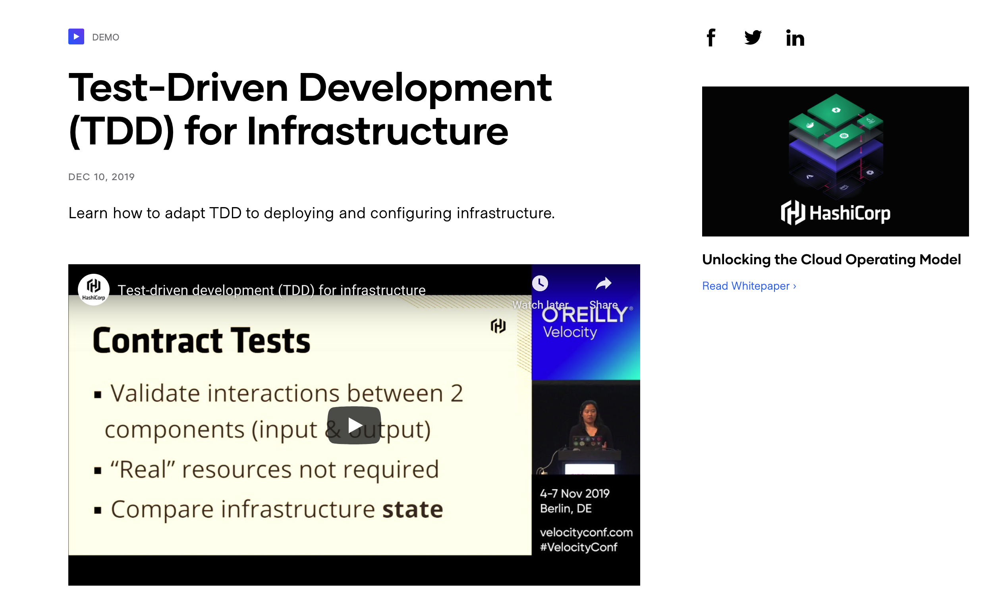

Embed any notable projects in this page.

## [Luna - ShellHacks 2020](https://github.com/pianelson/shellhacks2020)
### Luna is an AI-powered chatbot designed with Twilio to serve as a mental health check-in for Twitter users whose recent tweets have been deemed to be indicative negative emotions.

<iframe style="border: 1px solid rgba(0, 0, 0, 0.1);" width="1500" height="1025" src="https://www.figma.com/embed?embed_host=share&url=https%3A%2F%2Fwww.figma.com%2Fproto%2FfkxPpNiu3AXXgTkH9ypJHM%2FShellHacks-Luna%3Fnode-id%3D20%253A18%26viewport%3D448%252C326%252C0.38197198510169983%26scaling%3Dmin-zoom&chrome=DOCUMENTATION" allowfullscreen></iframe>

Our initial idea was filtering through twitter to find derogatory words and suggest alternative, kinder words, following along with Twitter's theme #HealthyConversations. We passed up this idea because we'd only be able to see those derogatory words after they've already been posted. Instead we wanted to do something that would benefit social media users proactively. We modified the initial idea a bit, and instead of derogatory words, we decided to look for negative words, or words indicating negative mood. We geared our project towards those struggling with mental llness as it has become more prevalent now than ever, and the pandemic limits people's ability to get help. We also got inspiration from Eliza, a chatbot who allows open ended venting about your day. In comparison, Eliza's responses are not as specific as ours and her UI is less visually appealing.

